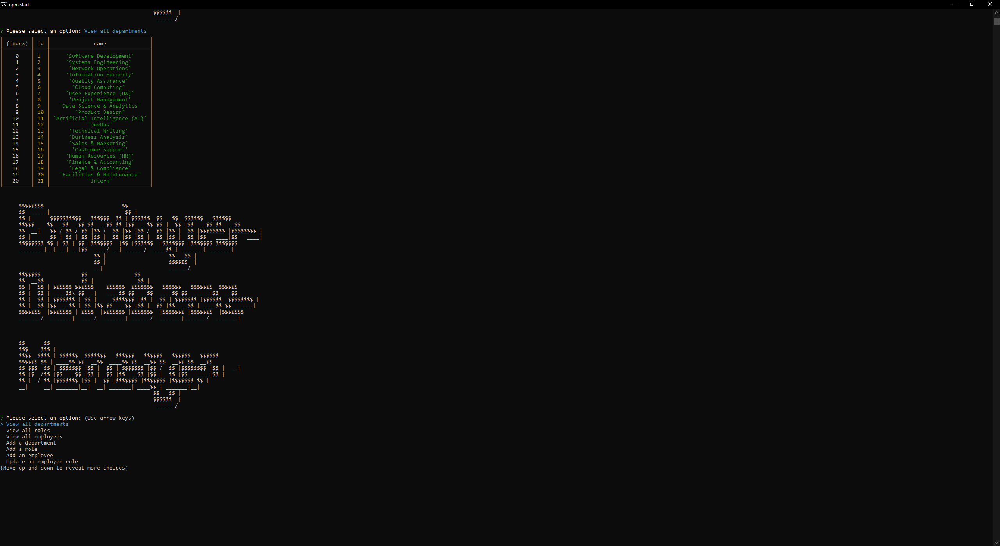

  # Employee Database Manager
  
  ## Description 
  This application was created with [MySQL](https://dev.mysql.com/doc/mysql-installation-excerpt/5.7/en/), [Node.js](https://nodejs.org/en), [mysql2](https://www.npmjs.com/package/mysql2) and [Inquirer](https://www.npmjs.com/package/inquirer). It is a content management system (CMS) that manages a company's employee database.
  
  ## Table of Contents
  * [Technology Stack](#technology-stack)
  * [User Story](#user-story)
  * [Acceptance Criteria](#acceptance-criteria)
  * [Installation](#installation)
  * [Screenshot](#screenshot)
  * [Usage](#usage)
  * [License](#license)
  * [Contributors](#contributors)
  * [Outside Resources](#outside-resources)
  * [Questions](#questions)

  ## Technology Stack


  ## User Story
  ```md
  AS A business owner
  I WANT to be able to view and manage the departments, roles, and employees in my company
  SO THAT I can organize and plan my business
  ```

  ## Acceptance Criteria
  ```md
  GIVEN a command-line application that accepts user input
  WHEN I start the application
  THEN I am presented with the following options: view all  
  departments, view all roles, view all employees, add a  
  department, add a role, add an employee, and update an  
  employee role
  WHEN I choose to view all departments
  THEN I am presented with a formatted table showing department  
  names and department ids
  WHEN I choose to view all roles
  THEN I am presented with the job title, role id, the department  
  that role belongs to, and the salary for that role
  WHEN I choose to view all employees
  THEN I am presented with a formatted table showing employee data,  
  including employee ids, first names, last names, job titles,  
  departments, salaries, and managers that the employees report to
  WHEN I choose to add a department
  THEN I am prompted to enter the name of the department and that  
  department is added to the database
  WHEN I choose to add a role
  THEN I am prompted to enter the name, salary, and department for  
  the role and that role is added to the database
  WHEN I choose to add an employee
  THEN I am prompted to enter the employee’s first name, last name,  
  role, and manager, and that employee is added to the database
  WHEN I choose to update an employee role
  THEN I am prompted to select an employee to update and their new  
  role and this information is updated in the database
  ```
  
  ## Installation 
  * Clone the repository.
  ```
    git clone git@github.com:erin-m-keller/keller-employee-tracker.git
  ```

  * Install the dependencies.
    * Install [MySQL](https://dev.mysql.com/doc/mysql-installation-excerpt/5.7/en/)
    npm install --save mysql2
    
  * CD into the db directory
  ```
    cd db/
  ```

  Start the MySQL server in the terminal (ensure you are in the db directory of the project)

  ``` bash
    mysql -u root -p 
  ```

  Enter the password
  ``` bash
    password_goes_here
  ```

  Once MySQL server has started, create the database

  ``` bash
    SOURCE schema.sql 
  ```

  Seed the database with data
  ``` bash
    SOURCE seed.sql
  ```

  Exit the MySQL server
  ``` bash
    exit OR quit
  ```

  * Return to the root directory
  ```
    cd ..
  ```

  Create an .env file in the root directory and set your local MySQL server username and password
  > Don't worry, it will only be saved to your local machine. The .env file is in .gitignore
  ``` bash
    DB_USER = "your_username_here"
    DB_PASSWORD = "your_password_here"
  ```
  Start the application
   ``` bash
    npm start
  ```
  > You'll be presented with the database interface

  ## Screenshot

  
  
  ## Usage
  
  [Watch Video]()

  > To open in a new tab, use CTRL + click (Windows) or CMD + click (MAC). Enjoy the music!
  
  ## License 


  ## Outside Resources

  * [ChatGPT](https://openai.com/blog/chatgpt): Used ChatGPT to generate the dummy data for [seed.sql](./seed.sql) 